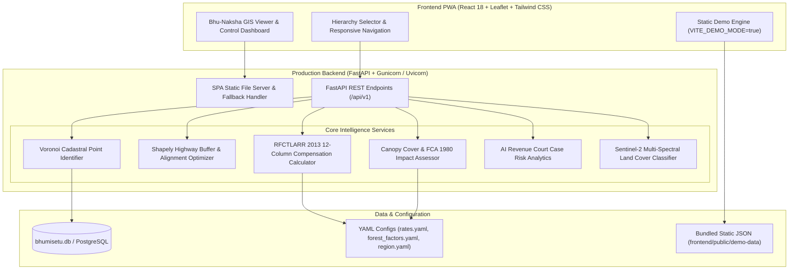

# 🌿 BHOOMI SETU (भूमि सेतु)
### National Digital Land Intelligence, Evidence-Based Infrastructure Acquisition & Forest Monitoring Platform

**Live Serverless Demo**: [https://devesh-pt.github.io/bhumisetu/](https://devesh-pt.github.io/bhumi-setu/)  
**GitHub Repository**: [https://github.com/devesh-pt/bhumisetu](https://github.com/devesh-pt/bhumi-setu)

[](https://github.com/devesh-pt/bhumisetu/actions/workflows/ci.yml)
[](https://devesh-pt.github.io/bhumisetu/)
[](LICENSE)
[](https://www.python.org/)
[](https://fastapi.tiangolo.com/)
[](https://react.dev/)
[](https://tailwindcss.com/)

---

## 📌 Problem Statement (SIH26019)

Infrastructure projects in India (Highways, Railways, Industrial Corridors) face severe delays and cost overruns due to:
1. **Opaque & Fragmented Land Acquisition**: High-fertile agricultural farmland is frequently acquired when adjacent barren (*Banjar*) land is available.
2. **Litigation & Compensation Disputes**: Inaccurate circle rate calculations, missing solatium factors, and lack of transparency lead to revenue court appeals under the *Right to Fair Compensation and Transparency in Land Acquisition, Rehabilitation and Resettlement Act, 2013 (RFCTLARR 2013)*.
3. **Unmonitored Forest Degradation**: Linear infrastructure corridors intersect protected forest reserves without early statutory clearance verification under the *Van (Sanrakshan Evam Samvardhan) Adhiniyam, 1980*.
4. **Mobile & Cross-Platform Inaccessibility**: Legacy GIS viewers suffer from overlapping parcel polygons, missing responsive mobile navigation, and heavy server dependencies.

**BHOOMI SETU** resolves these challenges by providing a unified digital land governance portal combining **Chhattisgarh Bhuiyan Cadastral Layer Sync**, **Non-Overlapping Voronoi Parcel Tessellation**, **AI Revenue Court Analytics**, **RFCTLARR 2013 Compensation Calculators**, **Area-Driven Forest Canopy Monitoring**, and **Serverless GitHub Pages PWA Support**.

---

## ✨ Key Feature Modules

1. **Bhu-Naksha GIS Map**: Interactive geospatial map viewer with non-overlapping cadastral parcel outlines, satellite tile basemaps, Khasra search, and instant parcel detail popups.
2. **Highways & Least-Cost Banjar Route**: Right-of-Way corridor buffer analysis (30m/45m/60m) that quantifies fertile vs. barren (*Banjar*) land intersection and suggests cost-optimal alignments penalizing high-value farmland.
3. **Muavja & Ready-Map Compensation**: Itemized 12-column compensation award generator enforcing Section 26-30 RFCTLARR 2013 formulas (Market Value $\times$ Multiplier $+$ 100% Solatium $+$ Structure Allowances) with 1-click Excel/CSV export.
4. **Forest Impact & Canopy Loss**: Real-time forest intersection calculator assessing tree density, canopy cover class, Net Present Value (NPV) compensation, and statutory clearance requirements under FCA 1980.
5. **Revenue Court Analytics**: Integrated litigation notice tracker, boundary dispute analytics, and AI risk scoring for decision support.

---

## 🏗️ System Architecture



---

## 🛠️ Technology Stack

- **Frontend**: React 18, TypeScript, Vite 5, Tailwind CSS, Leaflet, MapLibre GL, Lucide React, i18next (English & Hindi).
- **Backend**: Python 3.11, FastAPI, Pydantic v2, SQLAlchemy, Alembic, Uvicorn, Gunicorn.
- **Geospatial & ML**: Shapely, PyProj, GeoPandas, NumPy, Scikit-Learn, LightGBM.
- **Deployment**: Docker Multi-Stage, GitHub Actions CI/CD, GitHub Pages Serverless Static PWA, Render.com.

---

## 🔑 Demo Credentials

| Username | Password | Role | Description |
| :--- | :--- | :--- | :--- |
| `officer` | `officer123` | **Revenue Officer / Tehsildar** | Full access to cadastral extracts, revenue court disclaimers, mutation approvals, and exports. |
| `admin` | `admin123` | **System Administrator / LAO** | Full administrative rights, unmasked PII records, and system configuration access. |
| `citizen` | `user123` | **Public Citizen** | Read-only view with masked PII owner names and public land search. |

---

## ⚡ Quick Start

### Option 1: Docker Single-Command Run (Recommended)
```bash
# Build the production multi-stage image
docker build -t bhumisetu:latest .

# Run single container on port 8000
docker run -d -p 8000:8000 -e PORT=8000 --name bhumisetu_app bhumisetu:latest

# Open in browser
open http://localhost:8000
```

### Option 2: Docker Compose
```bash
docker compose up --build -d
```

### Option 3: Local Development
```bash
# Backend Setup
cd backend
python3 -m venv venv
source venv/bin/activate
pip install -r requirements.txt
python ../scripts/seed_cg_land.py
uvicorn app.main:app --host 127.0.0.1 --port 8000 --reload

# Frontend Setup (in another terminal)
cd frontend
npm install
npm run dev -- --port 3000
```

---

## 📊 Datasets & Rate Tables

| Module | Data Source / Standard | Licence | Configuration File |
| :--- | :--- | :--- | :--- |
| **Cadastral Hierarchy** | Chhattisgarh Bhuiyan Portal (33 Districts) | Open Government Data (OGD) | [`config/region.yaml`](config/region.yaml) |
| **Circle Rates & Multipliers** | CG Revenue Circle Rates & RFCTLARR 2013 | Open Government Data (OGD) | [`config/rates.yaml`](config/rates.yaml) |
| **Forest Factors & Carbon** | PARIVESH & Van Adhiniyam 1980 | Statutory Schedule | [`config/forest_factors.yaml`](config/forest_factors.yaml) |
| **ML Land Classifier** | Sentinel-2 L2A Multi-Spectral Imagery | ESA Open Access | `ml/models/land_classifier_metrics.json` |

---

## ⚠️ Statutory Advisory & Limitations

1. **Synthetic Demo Data Notice**: All land parcels, owner names, and court numbers in the public demo are synthetic data generated for Smart India Hackathon (SIH 2026) demonstration.
2. **Advisory AI Predictions**: AI dispute analytics and risk scores are decision support indicators and do not constitute legal rulings.
3. **Illustrative Compensation**: Compensation calculations are illustrative estimates; statutory awards must be verified with District Collector notifications under RFCTLARR 2013.

---

## 🔮 Future Scope

- **Direct PARIVESH API Integration**: Automated online submission for Form-A forest clearances.
- **Drone Survey LiDAR Mesh Overlay**: High-resolution 3D terrain mesh integration for mountainous corridor alignment.
- **Blockchain Tamper-Proof Land Audit**: Distributed ledger integration for immutable land title transfers.

---

## 📄 License

Distributed under the **MIT License**. See [`LICENSE`](LICENSE) for details.
